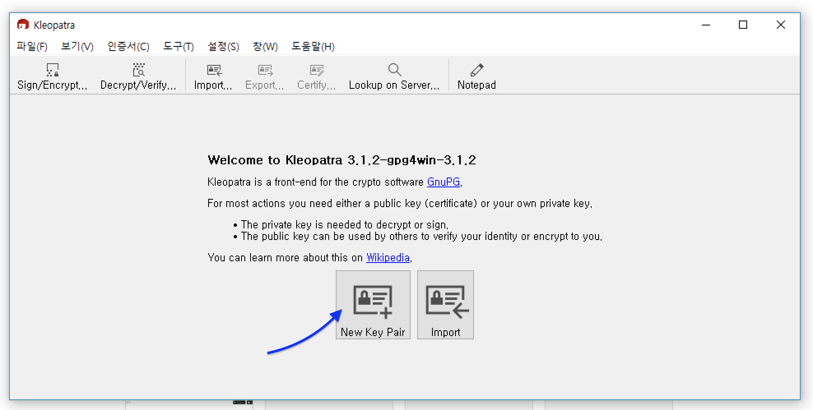
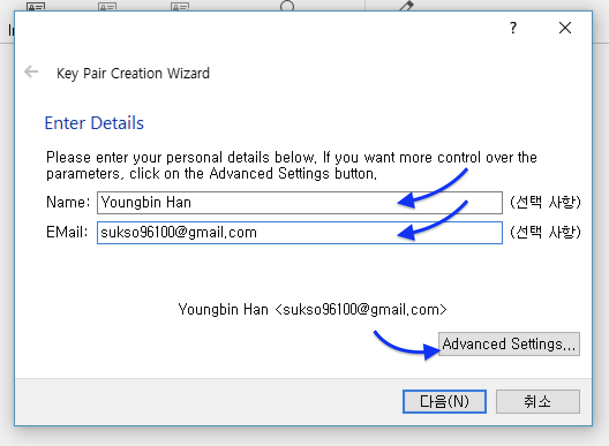
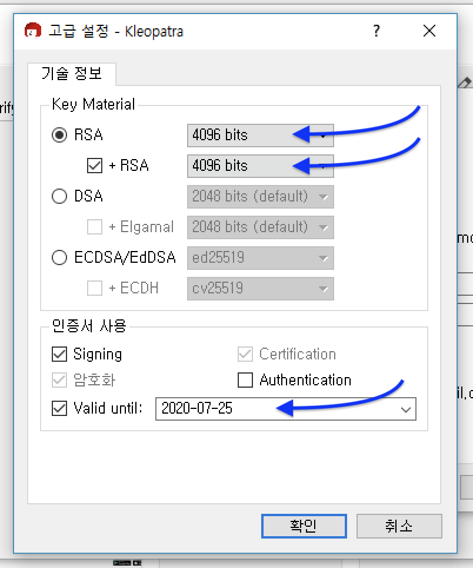
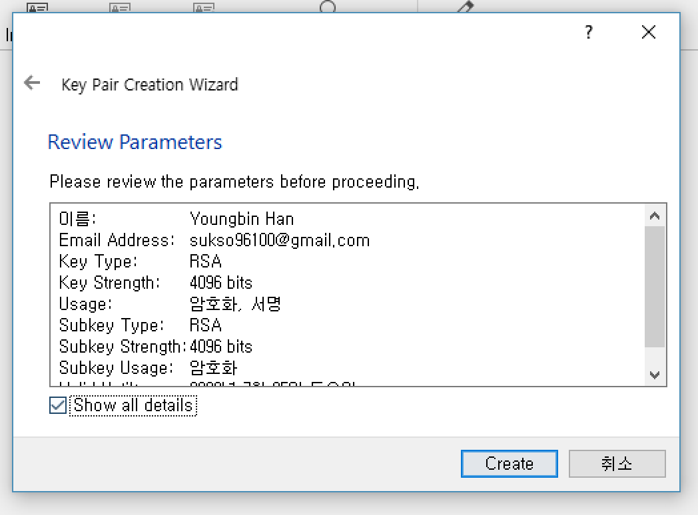
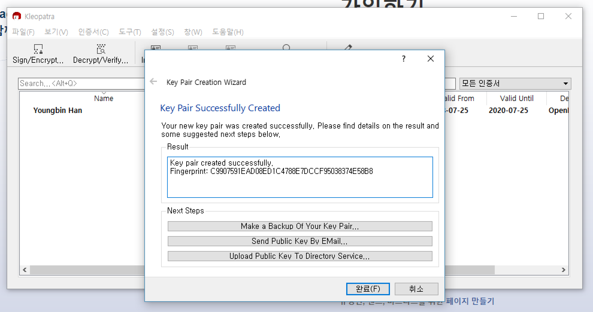
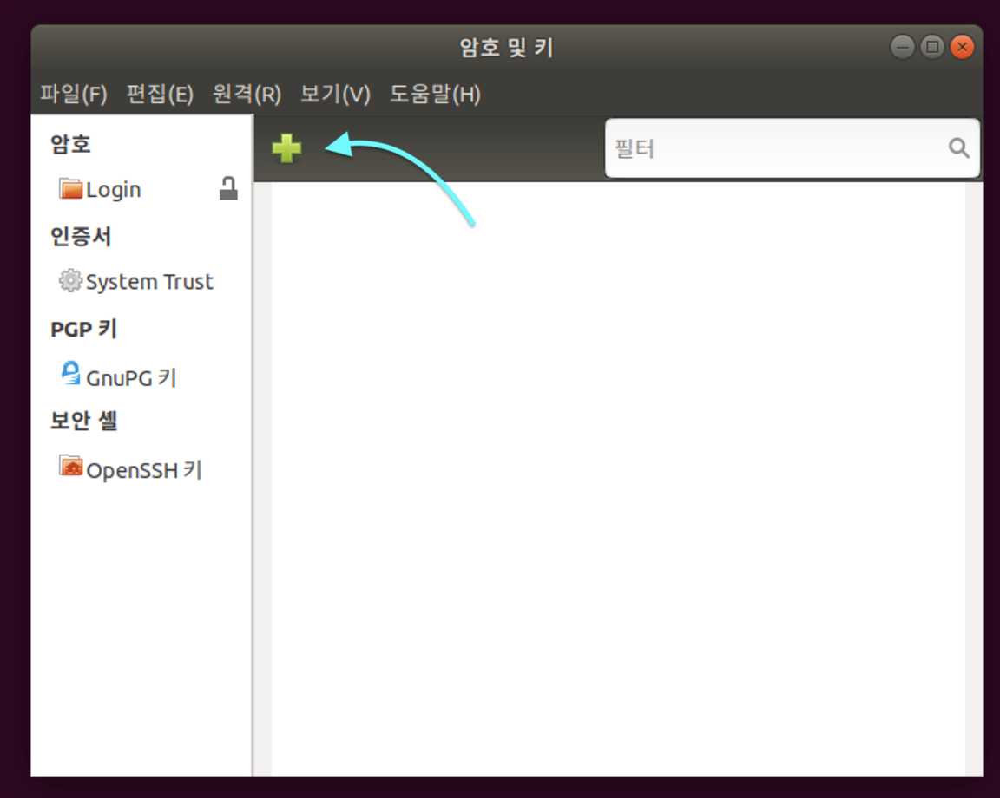
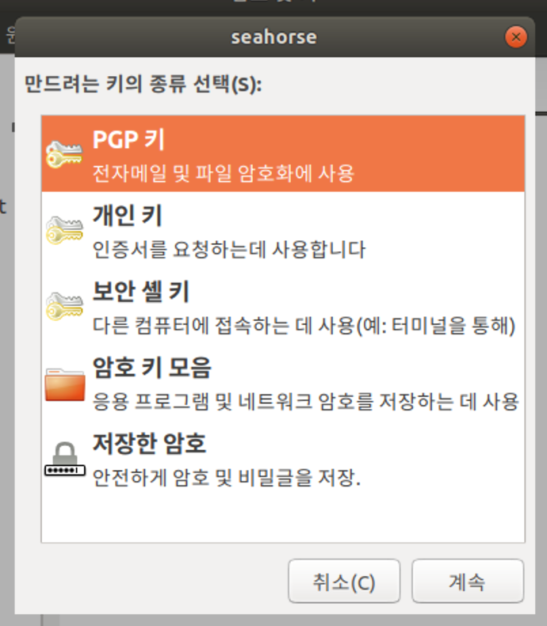
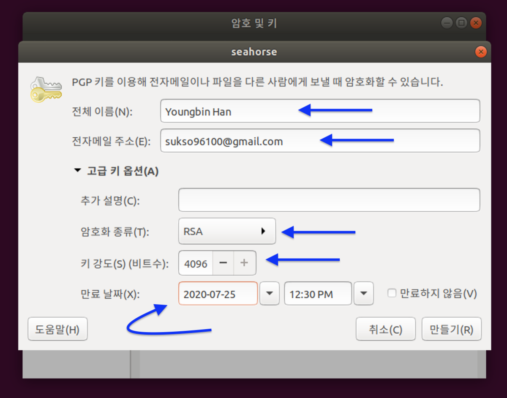
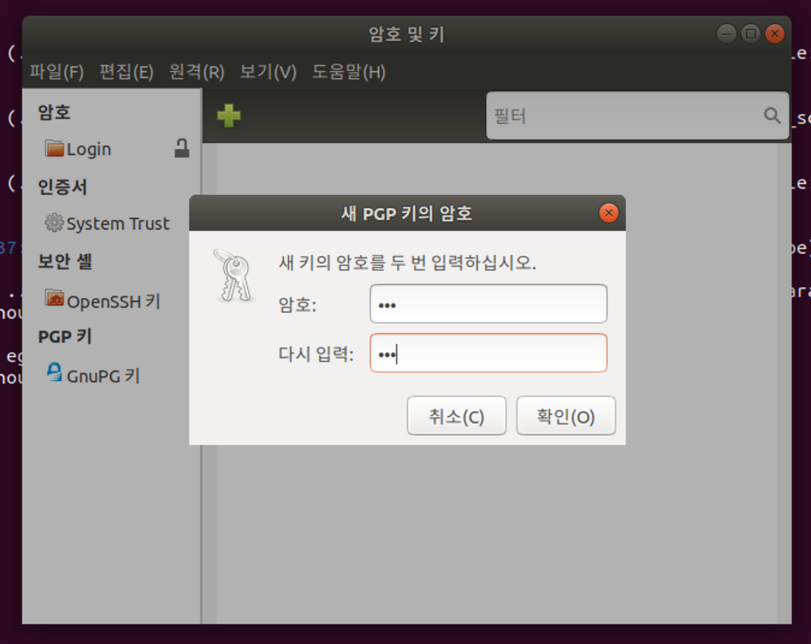

# GPG 키 생성하기

## 터미널에서 생성
`gpg` 명령어를 사용 가능한 환경 에서 사용 가능한 방법입니다.

### Ubuntu, Debian 에서 설치
보통 기본적으로 이미 설치 되어 있습니다.
```
sudo apt install gpg
```

### MacOS 에서 설치
Homebrew 를 사용하여 설치합니다.
```
brew install gpg
```

### 키 생성

- 먼저, `~/.gnupg/gpg.conf` 파일에, 아래와 같은 내용을 가장 마지막 줄에 추가합니다.
    - 키 생성시 키의 해싱 알고리즘 기본값을 정하는 설정입니다.
```
personal-digest-preferences SHA512
cert-digest-algo SHA512
default-preference-list SHA512 SHA384 SHA256 SHA224 AES256 AES192 AES CAST5 ZLIB BZIP2 ZIP Uncompressed
```

- 아래 명령으로, 키 생성을 시작합니다.
```bash
gpg --full-generate-key
```

- 키 유형은 RSA and RSA 로 합니다.
```
Please select what kind of key you want:
   (1) RSA and RSA (default)
   (2) DSA and Elgamal
   (3) DSA (sign only)
   (4) RSA (sign only)
Your selection? 1
```

- 키 길이는 최소 3072 이상으로 합니다. 4096을 권장합니다.
```
RSA keys may be between 1024 and 4096 bits long.
What keysize do you want? (2048) 4096
```

- 키 유효기간을 정합니다. 약 2년 안으로 하는 것을 권장합니다.
```
Please specify how long the key should be valid.
         0 = key does not expire
      <n>  = key expires in n days
      <n>w = key expires in n weeks
      <n>m = key expires in n months
      <n>y = key expires in n years
Key is valid for? (0) 2y
```

- 개인 신원을 입력합니다. 이름은 실명을 한글 또는 영문으로, 이메일은 자주 쓰는 것으로 사용합니다. 커멘트는 비워두는것이 좋습니다.
```
You need a user ID to identify your key; the software constructs the user ID
from the Real Name, Comment and Email Address in this form:
    "Heinrich Heine (Der Dichter) <heinrichh@duesseldorf.de>"

Real name: Test User
Email address: test@example.org
Comment: 
```

- 입력한 신원 정보 일치 여부를 확인합니다. 이후, 키가 생성 과정이 시작되는데, 랜담 바이트가 필요합니다. 웹 브라우징 등으로 랜덤 바이트 생성을 하면서 기다립니다.
```
You selected this USER-ID:
    "Test User <test@example.org>"

Change (N)ame, (C)omment, (E)mail or (O)kay/(Q)uit? o
You need a Passphrase to protect your secret key.

passphrase not correctly repeated; try again.
We need to generate a lot of random bytes. It is a good idea to perform
some other action (type on the keyboard, move the mouse, utilize the
disks) during the prime generation; this gives the random number
generator a better chance to gain enough entropy.
..........+++++
.................................+++++
```

## GUI 앱 사용

### Windows (gpg3win - Kleopatra)
- https://www.gpg4win.org/index.html 에서 프로그램을 받아 설치합니다.
- Kelopatra 프로그램을 사용하겠습니다. 프로그램을 켜고, `New Key Pair` 버튼을 누릅니다.   


- 본인의 신원 정보를 입력합니다. 실명과 자주 쓰는 이메일 주소를 입력합니다. 그리고 추가 설정을 위해, `Advanced Settings...` 을 누릅니다.   


- 키 유형과 길이, 만료일을 설정해 줍니다. 키 길이는 3072 이상으로 합니다. 4096을 권장합니다.   


- 키 정보를 확인한 후, `Create` 를 눌러 키 생성을 합니다.   


- 사용할 키 비밀번호를 입력합니다. 그리고 잠시 기다립니다.   


- 키가 생성되었습니다.   


> 2018년 7월 기준, gpg4win 의 Kleopatra 는 키의 기본 해싱 알고리즘을 SHA256 으로 하여 키를 생성합니다. 참고하시기 바랍니다.

### Ubuntu, Debian (Seahorse)
- 먼저, `~/.gnupg/gpg.conf` 파일에, 아래와 같은 내용을 가장 마지막 줄에 추가합니다.
    - 키 생성시 키의 해싱 알고리즘 기본값을 정하는 설정입니다.
```
personal-digest-preferences SHA512
cert-digest-algo SHA512
default-preference-list SHA512 SHA384 SHA256 SHA224 AES256 AES192 AES CAST5 ZLIB BZIP2 ZIP Uncompressed
```

- `+` 버튼을 눌러 키 생성을 시작합니다.   


- `PGP 키` 를 선택합니다.   


- 신원 정보를 입력합니다. 이름은 실명을, 이메일은 자주 사용하는 것으로 합니다.
- 고급 키 옵션에서, 암호화는 RSA, 키 강도를 3072이상(4096을 권장합니디.), 만료일을 약 2년 안으로 합니다.   


- 암호를 지정합니다.   


- 잠시 기다리면, 키가 사진처럼 생성 됩니다.   

